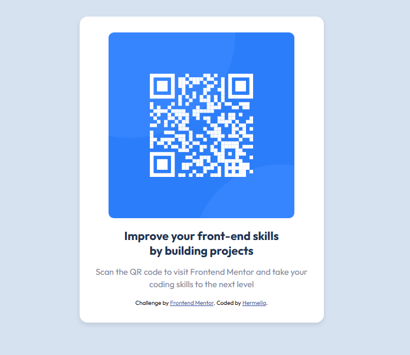

# Frontend Mentor - QR code component solution

This is a solution to the [QR code component challenge on Frontend Mentor](https://www.frontendmentor.io/challenges/qr-code-component-iux_sIO_H). Frontend Mentor challenges help you improve your coding skills by building realistic projects.

## Table of contents

- [Overview](#overview)
  - [Screenshot](#screenshot)
  - [Links](#links)
- [My process](#my-process)
  - [Built with](#built-with)
  - [What I learned](#what-i-learned)
  - [Continued development](#continued-development)
  - [Useful resources](#useful-resources)
- [Author](#author)
- [Acknowledgments](#acknowledgments)

**Note: Delete this note and update the table of contents based on what sections you keep.**

## Overview

### Screenshot

so i took a screenshot of my solution and added it in the image folder

qr-code-component-main/qr-codeimg.PNG

### Links

Solution URL:
Live Site URL:

### My Process

Built with
Semantic HTML5 markup
CSS custom properties
Flexbox
Mobile-first workflow

### What I learned

This project reinforced the importance of focusing on mobile-first design and how using flexbox can simplify layout creation. I also learned to implement responsive design using media queries to ensure the site looks good across various screen sizes, including mobile (375px) and desktop (1440px).

One challenge I overcame was ensuring the QR code image was properly aligned and scaled while maintaining the card's proportions. Here's an example of the CSS that helped me achieve this:

### css

.qr {
justify-content: center;
width: 100%;
max-width: 300px;
border-radius: 10px;
}
I also explored using custom properties for styling, which makes future updates much easier.

### Continued Development

I plan to focus more on mastering CSS Grid and flex box in future projects to handle more complex layouts. Additionally, I aim to refine my ability to integrate Javascript into my workflow for better visual consistency.

### Useful Resources

MDN Web Docs - Flexbox - This helped me better understand flexbox alignment and positioning, which was essential for centering the card.
Frontend Mentor - This platform provided the design challenge and helped me think critically about responsive web design.
geeks for geeks - they have a good explantion for html,css and few details i had missed

### Author

Website - hermella
Frontend Mentor - @hermuti
Twitter - @hemutiwo
